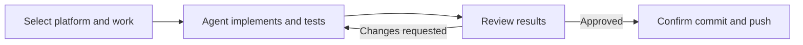

# Req2Code

[English](README.md) | [Simplified Chinese](README.zh-CN.md) | [Full guide](docs/USAGE.md)

[](https://github.com/XiuxianCoder/Req2Code/actions/workflows/ci.yml)
[](https://www.python.org/)
[](https://github.com/XiuxianCoder/Req2Code/stargazers)

Req2Code turns TAPD or Feishu work items into an approval-gated development workflow for the coding agent already open in your repository.

It lets you select one or more work items, gives their complete context to Codex, Claude Code, or Cursor, records implementation and test results, and opens a review before any commit or push. It does not start a second coding agent in the default workflow.

> Status: Alpha. Test with a staging work-item source and repository before production use.

## Quick start

Requirements: Python 3.10+, Git, `uv`, and Codex, Claude Code, or Cursor.

```powershell
uv tool install "git+https://github.com/XiuxianCoder/Req2Code.git"
req2code integrate codex
```

Use the matching integration command for another host:

```powershell
req2code integrate claude
req2code integrate cursor
```

`req2code integrate` installs the Skill and registers the local MCP server. You do not need to edit Codex, Claude Code, or Cursor configuration files manually. Restart the host or open a new agent session after integration.

Then open the repository you want to change and ask:

```text
Use $req2code-workflow to open Req2Code and let me choose a work-item platform and the work to solve.
```

## Current highlights

- Platform-first private UI: choose TAPD, Feishu, or Mock before choosing or creating a named project profile.
- TAPD supports Open Application OAuth2 and API-account Basic authentication.
- Feishu supports `/docx/`, `/wiki/`, `/base/`, and `/sheets/` links through a self-built application.
- Bitable columns do not need fixed names. The current agent maps title, description, type, status, priority, owner, acceptance, and other useful fields from field definitions, configured select options, and bounded samples.
- Saved Feishu view filters are ignored while reading records. Req2Code reads the complete table and then filters terminal/active rows locally using the confirmed mapping.
- Clicking AI analysis automatically sends only a short analysis ID. The schema is fetched through a read-only tool, so large JSON payloads and MCP App context attachments are not left in the composer.
- Credentials and complete unconfirmed rows stay local. Only the authorized schema sample and finally confirmed work items enter agent context.

`req2code setup` remains available as a terminal fallback for hosts without MCP Apps.

## Complete usage flow

1. Open the target code repository in Codex, Claude Code, or Cursor and start `$req2code-workflow`.
2. Choose TAPD, Feishu, or Mock, then reuse, edit, or create a named source profile in the private UI.
3. For Feishu Bitable, use **Load tables** to select the exact table. The URL view is kept for navigation and traceability, not for filtering the records API.
4. Click **AI analyze and select work items**. Req2Code automatically sends the analysis ID, the current agent returns a structured field mapping, and a fresh selector opens at the current conversation position.
5. Search, filter, and select one or more active requirements or defects. Obvious cover/instruction tables and locally recognized terminal rows are excluded.
6. Keep the current repository and branch by default, or explicitly choose a local/remote repository, target branch, and whether to run `git pull --ff-only`.
7. Confirm the selection. Req2Code sends the complete selected task, acceptance scope, repository rules, testing requirements, and approval boundary to the current agent.
8. The current agent implements every selected item, adds or updates tests, fixes relevant failures, and returns per-item implementation and test evidence.
9. Review the Chinese structured report. Request changes if needed; approval still performs no Git operation.
10. Use the separate publication dialog to acknowledge the exact destination branch. Only then may Req2Code commit and perform a non-force push.

## Workflow



Default behavior:

- Uses the repository and checked-out branch currently open in the coding agent.
- Does not pull, switch branches, commit, or push without an explicit user action.
- Supports one work item per branch or several selected items on one shared branch.
- Can also clone a remote repository and work on a specified branch.
- Requires a development review followed by a separate publication confirmation.

## In-chat experience

Select only actionable stories and bugs. Complete unconfirmed rows remain in the UI; only the explicitly authorized Bitable schema sample and the finally confirmed tasks enter model context.


Review each selected item's solution, changed files, test evidence, acceptance result, and residual risks.


Commit and non-force push remain locked until the second confirmation.


## Host support

| Host | Workflow | UI |
| --- | --- | --- |
| Codex desktop | End-to-end tested | Inline MCP Apps UI |
| Codex CLI | Supported | Text/terminal fallback |
| Cursor | Supported; current stable version recommended | MCP Apps where supported |
| Claude Code | Supported | Text/report or external review fallback |

Every fallback keeps the same approval boundary: no commit or push happens without explicit human approval.

## Configuration and security

Req2Code supports named TAPD Open Application OAuth2, TAPD API-account, Feishu self-built application, and Mock profiles. Add, edit, delete, and select them in the workflow UI. A Feishu profile requires an App ID, App Secret, and document access. Local configuration is resolved in this order:

1. `REQ2CODE_CONFIG`
2. `.req2code/config.yaml` in the current project
3. `~/.req2code/config.yaml`

TAPD and Feishu credentials are stored locally in the selected YAML file. Req2Code writes configuration atomically with restrictive permissions where supported. Protect it and exclude it from Git; this repository ignores its local `.req2code/` directory. On hosts without MCP Apps, use `req2code setup` in a private terminal and never paste credentials into chat.

## Develop and test Req2Code

```powershell
git clone https://github.com/XiuxianCoder/Req2Code.git
cd Req2Code
uv sync --extra test
uv run req2code --version
uv run python -m pytest -q
```

`uv` manages `.venv`; a uv-managed environment may not contain `pip`. Use `uv sync`, `uv run`, or `uv pip`.

## Documentation

- [Full usage guide](docs/USAGE.md)
- [Testing guide](docs/TESTING.md)
- [Contributing](CONTRIBUTING.md)
- [Security policy](SECURITY.md)

## Support

If Req2Code helps your workflow, please [star the repository](https://github.com/XiuxianCoder/Req2Code). It helps other developers discover the project.

## License

No open-source license has been selected yet. Until a `LICENSE` file is added, default copyright rules apply.
