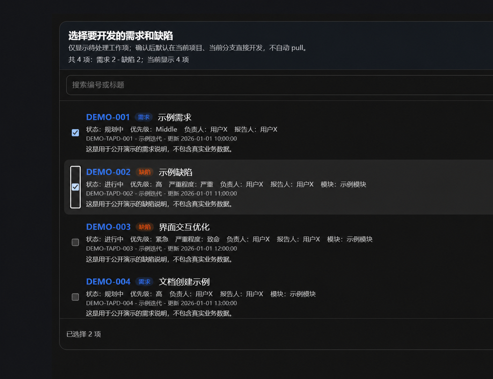
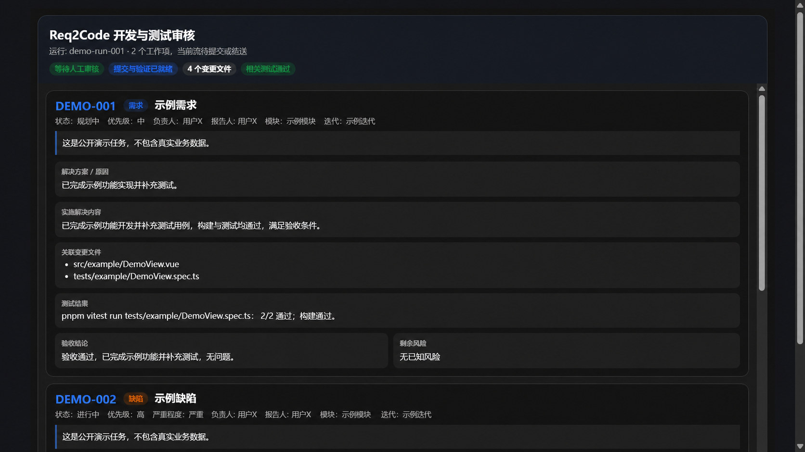
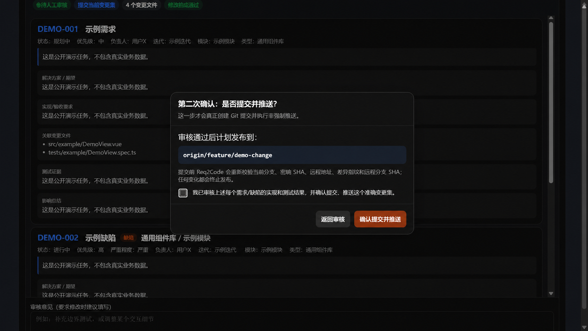

# Req2Code

[English](README.md) | [简体中文](README.zh-CN.md) | [完整使用指南](docs/USAGE.zh-CN.md)

[](https://github.com/XiuxianCoder/Req2Code/actions/workflows/ci.yml)
[](https://www.python.org/)
[](https://github.com/XiuxianCoder/Req2Code/stargazers)

Req2Code 将 TAPD 或飞书文档中的需求和缺陷转换成可审核的代码智能体开发流程，直接服务于当前已经打开项目的 Codex、Claude Code 或 Cursor。

用户可以选择一个或多个工作项，Req2Code 将完整任务交给当前智能体开发和测试，保存结果并打开审核界面。默认流程不会再启动第二个代码智能体，也不会在人工批准前提交或推送代码。

> 当前状态：Alpha。接入生产需求源和生产仓库前，请先使用测试环境验证。

## 快速开始

需要 Python 3.10+、Git、`uv`，以及 Codex、Claude Code 或 Cursor。

```powershell
uv tool install "git+https://github.com/XiuxianCoder/Req2Code.git"
req2code integrate codex
```

使用其他代码智能体时，运行对应命令：

```powershell
req2code integrate claude
req2code integrate cursor
```

`req2code integrate` 会同时安装 Skill 和注册本地 MCP，无需手工修改 Codex、Claude Code 或 Cursor 的配置文件。安装后重启宿主，或者新建一个智能体会话。

然后在需要开发的项目中输入：

```text
使用 $req2code-workflow，打开 Req2Code，让我选择需求平台和要解决的工作项。
```

## 当前版本重点

- 平台优先的私密界面：先选择 TAPD、飞书或 Mock，再选择、新增或修改该平台下的命名项目配置。
- TAPD 同时支持开放应用 OAuth2 和 API 账号 Basic 两种认证方式。
- 飞书通过自建应用连接，支持 `/docx/`、`/wiki/`、`/base/` 和 `/sheets/` 链接。
- 多维表格不要求固定列名。当前智能体会依据字段定义、单选/多选列配置项和少量样例，识别标题、问题描述、类型、状态、优先级、负责人、验收条件等字段。
- 读取多维表格记录时忽略飞书视图自带的筛选条件，先读取完整数据表，再根据确认后的字段映射在本地过滤已解决和未解决状态。
- 点击 AI 解析后只自动发送一个简短的分析 ID，字段数据由智能体通过只读工具取得，不再把大段 JSON 或 MCP App 上下文附件留在输入框。
- 凭据和完整未确认行始终保留在本地；只有明确授权的字段样例和最终确认的工作项会进入智能体上下文。

不支持 MCP Apps 的宿主仍可使用 `req2code setup` 作为终端降级方式。

## 完整使用流程

1. 在 Codex、Claude Code 或 Cursor 中打开目标代码仓库，启动 `$req2code-workflow`。
2. 选择 TAPD、飞书或 Mock，然后在私密界面中复用、修改或新增一个命名的需求源配置。
3. 使用飞书多维表格时，点击“读取数据表”选择准确的数据表；URL 中的视图仅用于导航和溯源，不用于限制记录读取范围。
4. 点击“AI 解析并选择工作项”。Req2Code 自动发送分析 ID，当前智能体返回结构化字段映射，新的工作项选择器会出现在当前对话位置。
5. 搜索、筛选并勾选一个或多个待处理需求或缺陷；封面/使用说明表和本地识别出的终态记录不会进入候选列表。
6. 默认继续使用当前仓库和当前分支；也可以明确选择本地或远程仓库、目标分支，以及是否执行 `git pull --ff-only`。
7. 确认选择后，Req2Code 将完整工作项、验收范围、仓库规则、测试要求和人工审批边界自动交给当前智能体。
8. 当前智能体完成所有选中工作项的开发，补充或修改测试，修复相关失败，并按工作项返回实现与测试证据。
9. 在中文结构化审核界面中检查结果；可以要求继续修改，点击审核通过也不会立即执行 Git 操作。
10. 在独立的发布确认框中核对并确认准确的目标分支；只有这一步完成后，Req2Code 才允许提交并执行非强制推送。

## 工作流程


默认规则：

- 使用当前代码智能体打开的项目和已检出分支。
- 未经用户明确要求，不 pull、不切换分支、不提交、不推送。
- 支持一个工作项一个分支，也支持多个工作项共用一个分支。
- 也可以克隆远程仓库并指定开发分支。
- 开发审核和发布确认分成两个独立步骤。

## 对话内体验

选择器只展示可处理的需求和 Bug。完整未确认行不会进入模型上下文；只有明确授权的多维表格字段样例和最终确认的任务会进入上下文。



审核界面按工作项展示解决方案、修改文件、测试证据、验收结果和剩余风险。



只有通过第二次确认，才允许提交并执行非强制推送。



## 宿主支持

| 宿主 | 工作流 | 界面 |
| --- | --- | --- |
| Codex 桌面版 | 已完成端到端测试 | 对话内 MCP Apps UI |
| Codex CLI | 支持 | 终端文字降级 |
| Cursor | 支持，建议使用当前稳定版 | 客户端支持时使用 MCP Apps |
| Claude Code | 支持 | 文字报告或外部审核页降级 |

所有降级方式都保留相同安全边界：没有人工明确批准就不会提交或推送。

## 配置与安全

Req2Code 支持命名的 TAPD 开放应用 OAuth2、TAPD API 账号、飞书自建应用和 Mock 配置，可直接在工作流界面中新增、编辑、删除和选择。飞书配置需要 App ID、App Secret，且目标文档须对该应用身份开放读取权限。配置读取顺序为：

1. `REQ2CODE_CONFIG` 指定的文件
2. 当前项目的 `.req2code/config.yaml`
3. `~/.req2code/config.yaml`

TAPD 和飞书自建应用凭据保存在所选的本地 YAML 文件中。Req2Code 会原子写入配置，并在系统支持时限制文件权限。请保护配置且禁止提交到 Git，本仓库已经忽略本地 `.req2code/` 目录。不支持 MCP Apps 的宿主可在私密终端运行 `req2code setup`，但不要在聊天中发送密钥。

## 开发和测试 Req2Code

```powershell
git clone https://github.com/XiuxianCoder/Req2Code.git
cd Req2Code
uv sync --extra test
uv run req2code --version
uv run python -m pytest -q
```

`uv` 负责管理 `.venv`；uv 创建的环境可能没有 `pip`，请使用 `uv sync`、`uv run` 或 `uv pip`。

## 文档

- [完整使用指南](docs/USAGE.zh-CN.md)
- [测试指南](docs/TESTING.zh-CN.md)
- [贡献指南](CONTRIBUTING.md)
- [安全策略](SECURITY.md)

## 支持项目

如果 Req2Code 对你的工作有帮助，欢迎为 [Req2Code 点一个 Star](https://github.com/XiuxianCoder/Req2Code)。你的支持可以帮助更多开发者发现这个项目。

## 开源协议

当前尚未选择开源协议。添加 `LICENSE` 前，默认版权规则仍然适用。
